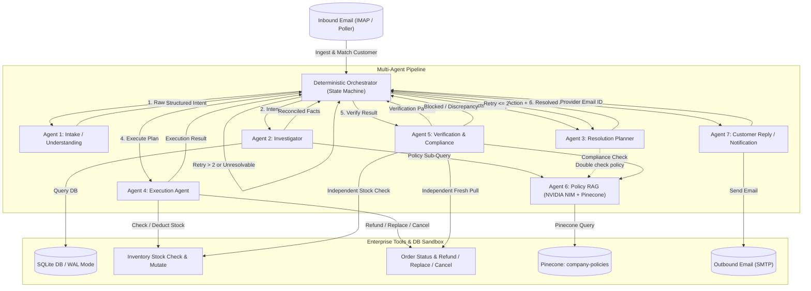

# Autonomous Customer Resolution Multi-Agent System
**Tech Zephyr Hackathon &bull; Problem Statement 5: Autonomous Customer Resolution Agent**

An end-to-end multi-agent, autonomous customer-resolution system that **resolves** customer issues across simulated enterprise systems (orders, inventory, customer accounts, and policy compliance). Customer issues arrive via real email (IMAP or virtual intake), and once resolved or escalated, the system sends an email reply to the customer threaded to the original message.

---

## 🌟 Key Architectural Highlights

- **7 Distinct Logical Agents** with strict JSON schemas and restricted tool privileges.
- **Deterministic (Non-LLM) Orchestrator**: Python state machine governing state transitions, replanning cycles, and loop guards.
- **Dedicated Policy RAG Agent (Agent 6)**: Powered by NVIDIA NIM (`meta/llama3-70b-instruct`), NVIDIA's retrieval-tuned embedding model `nv-embedqa-e5-v5` (1024-dim, asymmetric `passage` vs `query`), and Pinecone vector index `company-policies`.
- **Genuinely Stateful Enterprise Sandbox**: SQLite (PostgreSQL compatible) backing customers, orders, inventory with disruption levers, policy metadata, inbound emails, outbound emails, and chronological audit logs.
- **State-Mutating Tools**: `refund_action`, `replace_action` (blocks on 0 stock), `cancel_action` (guards post-shipment cancellation).
- **Independent Verification Agent (Agent 5)**: Never self-grades; independently pulls fresh state from tools and validates policy compliance before closing cases.
- **Loop Guardrail**: Strict limit of 2 replanning attempts before forced escalation to prevent infinite agent loops.
- **Automated Evaluation Harness**: 18 synthetic benchmark test cases with 100% pass rate.
- **Reactive Cyber Dashboard**: Built with React + Vite and Vanilla CSS, featuring live state progression timelines, agent trace streams, and judge-facing disruption controls.

---

## 🏗️ Multi-Agent Architecture



### Logical Agent Roles & Schemas

| Agent | Purpose | Tools Allowed | LLM Engine |
|---|---|---|---|
| **Agent 1: Intake** | Parses raw customer email into structured intent | None (pure extraction) | Google Gemini 2.0 Flash |
| **Agent 2: Investigator** | Reconciles customer, order, inventory, & policy | `customer_db_lookup`, `order_api_lookup`, `inventory_api_check`, Agent 6 | Google Gemini 2.0 Flash |
| **Agent 3: Planner** | Chooses resolution adhering strictly to policy | `policy_rag_search` (Agent 6) | Google Gemini 2.0 Flash |
| **Agent 4: Execution** | Executes state-changing actions | `refund_action`, `replace_action`, `cancel_action` | Minimal Gemini caller |
| **Agent 5: Verification** | Independent check against fresh state & policy | `order_api_lookup`, `inventory_api_check`, Agent 6 | Google Gemini 2.0 Flash |
| **Agent 6: Policy RAG** | Retrieval-augmented answering over handbook | `pinecone_query` (asymmetric embedding) | NVIDIA NIM (`meta/llama3-70b-instruct`) |
| **Agent 7: Customer Reply** | Composes threaded email reply (`Re: `) | `send_email` | Google Gemini 2.0 Flash |

---

## ⚡ Live Disruption Scenarios (Judge Testing)

The system includes dedicated triggers to demonstrate adaptive resilience live:

1. **Inventory Block (Scenario 1)**:
   - Customer requests replacement for `ord_104` (SonicBoom Speaker).
   - Execution Agent encounters 0 stock &rarr; reports `blocked - out of stock`.
   - Orchestrator routes to replanning &rarr; Planner converts request to `refund` per Replacement Rules Section 2(b).
   - Execution succeeds &rarr; Verification confirms &rarr; Agent 7 sends apologetic and reassuring refund email.
2. **Chained Failure (Scenario 3)**:
   - Primary SKU (`SKU-DRONE-X`) has 0 stock &rarr; first replacement blocked.
   - Alternate SKU (`SKU-DRONE-X-BLU`) also has 0 stock &rarr; second replacement blocked.
   - Orchestrator recognizes 2 consecutive failures &rarr; halts loop and forces human escalation.
3. **Out-of-Policy Return (Scenario 4)**:
   - Regular customer requests return for `ord_103` at 42 days (limit 30 days).
   - Planner refuses to invent an exception and directly escalates citing Return Window Policy Section 1 & 3.
4. **Policy Exception Override**:
   - Defective item in `ord_107` reported at 50 days (past 30/45-day window).
   - Planner correctly applies 60-day defect window per Damaged and Defective Items Policy Section 2.

---

## 📊 Evaluation Benchmark Results

Run the automated evaluation suite against all 18 synthetic cases:
```bash
python -m evaluation.harness
```

**Results:**
- **Total Cases**: 18
- **Passed Cases**: 18 / 18
- **Pass Rate**: **100.0%**
- **Average Latency**: **0.088s per case**

---

## 🚀 Quickstart & Running Locally

### Option A: Local Run (Recommended)

1. **Backend**:
   ```bash
   pip install -r requirements.txt
   uvicorn backend.app:app --reload --port 8000
   ```
2. **Frontend**:
   ```bash
   cd frontend
   npm install
   npm run dev
   ```
3. Open `http://localhost:5173` in your browser.

### Option B: Docker Compose

```bash
docker compose up --build
```
Access the dashboard at `http://localhost:5173` and API docs at `http://localhost:8000/docs`.

---

## 📁 Repository Structure

```
Tech_zypher_hackathon/
├── backend/
│   ├── app.py                    # FastAPI server
│   ├── database.py               # SQLite/PostgreSQL schema & seed data
│   ├── models.py                 # Pydantic data schemas
│   ├── tools.py                  # Stateful enterprise sandbox tools
│   ├── email_service.py          # Real IMAP/SMTP & virtual intake
│   ├── orchestrator.py           # Deterministic state machine
│   └── agents/
│       ├── base.py               # LLM provider connections (Gemini & NVIDIA)
│       ├── agent1_intake.py      # Intake / Understanding Agent
│       ├── agent2_investigator.py# Investigator Agent
│       ├── agent3_planner.py     # Resolution Planner Agent
│       ├── agent4_execution.py   # Execution Agent
│       ├── agent5_verification.py# Independent Verification Agent
│       ├── agent6_policy_rag.py  # Dedicated Policy RAG Agent
│       └── agent7_reply.py       # Customer Reply Agent
├── rag/
│   ├── combined_policies.md      # 8-section company policy corpus
│   ├── embedding.py              # NVIDIA nv-embedqa-e5-v5 embedding module
│   ├── ingest_policies.py        # Pinecone upsert script
│   └── agent6_rag_query.py       # Pinecone query tool
├── evaluation/
│   ├── test_cases.json           # 18 synthetic benchmark cases
│   └── harness.py                # Evaluation runner and reporter
└── frontend/
    ├── src/
    │   ├── App.jsx               # Main React dashboard
    │   ├── index.css             # Custom cyber dark-mode theme
    │   └── components/
    │       ├── Header.jsx
    │       ├── StateTimeline.jsx
    │       ├── EmailIntakePanel.jsx
    │       ├── AgentTraceViewer.jsx
    │       ├── CaseStateView.jsx
    │       └── EvaluationModal.jsx
```
