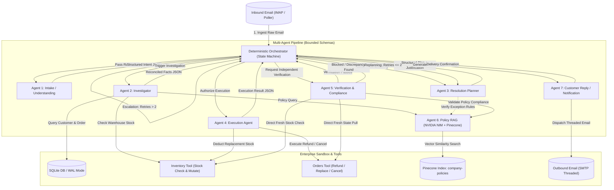

## 📌 Executive Summary & Project Overview

The **Autonomous Customer Resolution Multi-Agent System** is an enterprise-grade solution engineered for **Tech Zephyr Hackathon &bull; Problem Statement 5: Autonomous Customer Resolution Agent**.

Traditional customer service automation suffers from high failure rates caused by naive, single-prompt Large Language Models (LLMs) or rigid keyword decision trees:
- **Hallucinated State**: Standard LLMs often promise refunds or replacements without executing actual database transactions or verifying warehouse inventory.
- **Infinite Loops**: When an action fails (e.g., replacement item out of stock), traditional chatbots get stuck in repetitive responses or hallucinate arbitrary solutions.
- **Overprivileged Agents**: Giving an LLM direct, unrestricted access to company financial ledgers, customer credit records, and shipping APIs creates severe security and regulatory compliance risks.
- **Lack of Independent Verification**: LLMs that self-grade their own resolutions consistently suffer from confirmation bias and fail to catch policy non-compliance.

### The Solution

Our architecture resolves customer claims end-to-end across realistic, stateful enterprise systems (orders, inventory, customer tier accounts, company policies, and email communication):

1. **Deterministic Orchestrator (Non-LLM State Machine)**: A Python finite state machine that enforces strict lifecycle transitions, replay guards, and a maximum of **2 replanning cycles** before forcing human escalation.
2. **7 Least-Privilege Logical Agents**: Each agent is bounded by strict Pydantic JSON schemas and allowed access only to the specific tools required for its discrete step.
3. **Dedicated Policy RAG Agent (Agent 6)**: Grounded on official company policy handbooks using **NVIDIA NIM** (`meta/llama3-70b-instruct`), NVIDIA's asymmetric retrieval model `nv-embedqa-e5-v5` (1024-dim), and a Pinecone vector index (`company-policies`), backed by deterministic local chunk scoring.
4. **Independent Verification Agent (Agent 5)**: Never self-grades. Agent 5 independently fetches fresh records directly from the database and warehouse inventory to verify actual state mutation and policy compliance before closing any case.
5. **Real-World & Virtual Inbound/Outbound Email**: Supports live IMAP email polling, virtual intake injection for testing, and RFC-822-compliant threaded email replies (`In-Reply-To`, `References`, and `Re:` headers) sent via SMTP.
6. **Reactive Cyberpunk Dashboard**: A React 18/19 + Vite dashboard featuring a live visual state machine timeline, streaming agent traces, audit log inspection, and live judge disruption injection controls.
7. **Automated Evaluation Harness**: Built-in benchmark suite executing **18 synthetic test cases** covering standard returns, replacements, pre-shipment cancellations, out-of-stock replans, chained failures, and warranty overrides with a **100% pass rate**.

---

## 📂 Project Directory Structure & Folder Diagram

Below is the complete ASCII directory tree representing every folder and file in the workspace:

```
Tech_zypher_hackathon/
│
├── .env                                # Active environment configuration file (API keys, ports, DB paths)
├── .env.example                        # Template environment configuration with descriptions
├── .gitignore                          # Git exclusion rules (node_modules, caches, secrets, DB files)
├── Dockerfile                          # Multi-stage Docker containerization for the FastAPI backend
├── docker-compose.yml                  # Multi-container orchestration (FastAPI backend + Vite frontend)
├── package.json                        # Root workspace scripts (if configured)
├── README.md                           # Master project documentation, architecture, & file guide
├── requirements.txt                    # Python package dependencies (FastAPI, Pydantic, Pinecone, Google GenAI, etc.)
│
├── backend/                            # Core FastAPI backend, deterministic orchestrator, & agent pipeline
│   ├── __init__.py                     # Backend Python package marker
│   ├── app.py                          # FastAPI web application, REST endpoints, CORS, & startup events
│   ├── database.py                     # SQLite WAL-mode connection management, schema migrations, seed data, audit trail
│   ├── email_service.py                # Inbound IMAP polling, virtual intake, outbound SMTP threading engine
│   ├── models.py                       # Pydantic schemas for all 7 agents, case states, database models, & trace events
│   ├── orchestrator.py                 # Deterministic non-LLM finite state machine, loop guardrails, & replanning logic
│   ├── tools.py                        # Stateful enterprise sandbox tools (refund, replace, cancel, inventory checks)
│   │
│   └── agents/                         # The 7 discrete, least-privilege logical agents
│       ├── __init__.py                 # Agents package marker
│       ├── base.py                     # LLM client initializers (Gemini 2.0 Flash & NVIDIA NIM fallback clients)
│       ├── agent1_intake.py            # Agent 1: Ingestion & Intent Understanding Agent (extracts order, sentiment, remedy)
│       ├── agent2_investigator.py      # Agent 2: Facts & History Reconciler (queries customer DB, order status, inventory)
│       ├── agent3_planner.py           # Agent 3: Resolution Planner (evaluates policy constraints & produces structured plan)
│       ├── agent4_execution.py         # Agent 4: Execution Agent (invokes restricted state-mutating enterprise tools)
│       ├── agent5_verification.py      # Agent 5: Independent Verification & Compliance Agent (validates fresh DB state)
│       ├── agent6_policy_rag.py        # Agent 6: Dedicated Policy RAG Agent (Pinecone + NVIDIA NIM handbook retrieval)
│       └── agent7_reply.py             # Agent 7: Customer Communication Agent (generates polite, threaded email replies)
│
├── data/                               # Persistent database files, initial SQL schemas, & raw policy documents
│   ├── combined_policies.md            # Raw markdown handbook containing all 8 official company resolution policies
│   ├── customer_resolution.db          # Active SQLite WAL database file containing customer records, orders, & audit logs
│   └── db_init.sql                     # Raw SQL DDL file containing schema definitions, constraints, & baseline seed data
│
├── evaluation/                         # Comprehensive evaluation harness and synthetic benchmark test cases
│   ├── benchmark_report.json           # Output report generated by evaluation harness (pass/fail, latencies, statistics)
│   ├── harness.py                      # Automated evaluation runner executing 18 benchmark test cases through the pipeline
│   └── test_cases.json                 # Comprehensive test dataset: 18 synthetic test scenarios with expected outcomes
│
├── frontend/                           # Reactive Cyber Dark-Mode Dashboard (React 18/19 + Vite)
│   ├── .oxlintrc.json                  # Fast JavaScript/JSX linter configuration (Oxlint)
│   ├── Dockerfile                      # Frontend container build definition
│   ├── index.html                      # HTML5 entry point for the single-page application
│   ├── package.json                    # Frontend Node.js dependencies, scripts, and build metadata
│   ├── package-lock.json               # Deterministic dependency lockfile
│   ├── README.md                       # Frontend-specific documentation
│   ├── vite.config.js                  # Vite configuration, dev server port, and backend API proxy routing
│   │
│   ├── public/                         # Static assets served at root
│   │   ├── favicon.svg                 # Application favicon
│   │   └── icons.svg                   # SVG icon sprite sheet
│   │
│   └── src/                            # React application source code
│       ├── App.css                     # Component layout and responsive grid styles
│       ├── App.jsx                     # Top-level React container managing active case state, polling, & disruption triggers
│       ├── index.css                   # Cyber dark-mode theme, glassmorphism design tokens, CSS variables, & animations
│       ├── main.jsx                    # React 19 application root bootstrap
│       │
│       ├── assets/                     # Static graphics and branding illustrations
│       │   ├── hero.png                # Cyberpunk dashboard banner graphic
│       │   ├── react.svg               # React logo asset
│       │   └── vite.svg                # Vite logo asset
│       │
│       └── components/                 # Modular, reusable UI dashboard components
│           ├── AgentTraceViewer.jsx    # Live streaming console displaying agent thoughts, tool inputs, & JSON traces
│           ├── CaseStateView.jsx       # Inspector panel rendering customer tier, order details, inventory, & DB diffs
│           ├── EmailIntakePanel.jsx    # Interactive email simulator allowing judges to trigger custom/pre-set emails
│           ├── EvaluationModal.jsx     # Interactive modal executing the 18-case benchmark and displaying pass rates
│           ├── Header.jsx              # Application header bar with system status badges and active case selector
│           └── StateTimeline.jsx       # Visual interactive stepper tracking the 7-stage state machine progression
│
├── rag/                                # Dedicated Policy Retrieval-Augmented Generation (RAG) module
│   ├── __init__.py                     # RAG package marker
│   ├── agent6_rag_query.py             # Pinecone vector search and similarity retrieval engine
│   ├── combined_policies.md            # Canonical copy of the company policy document for chunking and embeddings
│   ├── embedding.py                    # NVIDIA `nv-embedqa-e5-v5` embedding client (1024 dimensions, query/passage modes)
│   └── ingest_policies.py              # Ingestion pipeline: parses policy markdown, generates vectors, & upserts to Pinecone
│
└── tests/                              # Automated unit tests for tools and agents
    ├── __init__.py                     # Tests package marker
    ├── test_agent6.py                  # Unit tests for Agent 6 (Policy RAG retrieval accuracy, citations, and confidence)
    └── test_tools.py                   # Unit tests for enterprise sandbox tools (stock deductions, refund limits, cancel rules)
```

---

## 🗂️ Detailed File-by-Folder Reference Guide

This section explains the role, responsibilities, key functions, and dependencies of every folder and file in the project.

### 1. Root Directory

| File | Type | Description |
|---|---|---|
| `.env` | Config | Active environment configuration holding API keys (`GEMINI_API_KEY`, `NVIDIA_API_KEY`, `PINECONE_API_KEY`), database path, IMAP/SMTP credentials, and `SIMULATED_AI` flag. |
| `.env.example` | Config | Documented template showing all available environment variables, defaults, and usage notes. |
| `Dockerfile` | DevOps | Multi-stage Dockerfile packaging the Python FastAPI backend with all dependencies into a lightweight runtime container. |
| `docker-compose.yml` | DevOps | Orchestrates the backend service (`app:8000`) and the frontend dashboard (`app:5173`) into a single unified container network. |
| `requirements.txt` | Config | Specifies all pinned Python package requirements: `fastapi`, `uvicorn`, `pydantic`, `openai`, `pinecone`, `google-genai`, `httpx`, `aiosmtplib`, `pytest`. |
| `README.md` | Docs | Comprehensive project documentation, architectural blueprints, folder diagrams, benchmark results, and quickstart instructions. |

---

### 2. `backend/` Folder

The `backend/` directory houses the FastAPI web service, database connection manager, deterministic state machine orchestrator, enterprise tools, and email adapters.

| File | Primary Role & Responsibilities | Key Functions / Classes |
|---|---|---|
| `backend/app.py` | FastAPI server exposing REST APIs for case intake, manual step-by-step driving, disruption injection, audit trail queries, and evaluation benchmark triggers. | `startup_event()`, `health_check()`, `submit_email()`, `execute_step()`, `run_full_case()`, `disrupt_inventory()`, `trigger_evaluation()` |
| `backend/database.py` | SQLite connection manager with Write-Ahead Logging (WAL) enabled. Handles database schema creation, initial dataset seeding, record reset utilities, and chronological audit logging. | `get_db()`, `seed_db()`, `reset_db()`, `log_audit()`, `get_audit_trail()` |
| `backend/email_service.py` | Inbound and outbound email management. Polls live customer emails over IMAP, provides an instant sandbox virtual intake adapter, and dispatches RFC-822 threaded replies using SMTP. | `fetch_new_emails()`, `simulate_inbound_email()`, `send_email_reply()`, `mark_email_processed()` |
| `backend/models.py` | Pydantic v2 data models defining the contractual input/output schemas for all 7 agents, audit log entries, tool return envelopes, and the global `CaseState` container. | `RawEmail`, `Agent1Output`, `Agent2Output`, `Agent3Output`, `Agent4Output`, `Agent5Output`, `Agent6Output`, `Agent7Output`, `CaseState` |
| `backend/orchestrator.py` | The deterministic non-LLM finite state machine orchestrating case lifecycles. Enforces sequential execution, manages state transitions, counts retries, and forces human escalation after 2 replans. | `create_case_from_email()`, `step_case()`, `run_case_to_completion()`, `get_case_state()`, `save_case_to_db()` |
| `backend/tools.py` | Stateful enterprise sandbox tool functions with strict business rules: inventory stock checks/mutations, customer order queries, order refunds, replacements, and cancellations. | `customer_db_lookup()`, `order_api_lookup()`, `inventory_api_check()`, `refund_action()`, `replace_action()`, `cancel_action()`, `set_inventory_stock()` |
| `backend/__init__.py` | Python package initialization file. | Package namespace definition |

---

### 3. `backend/agents/` Folder

Contains the 7 discrete logical agents. Each agent operates with strict least-privilege tool access, isolated JSON input/output schemas, and specialized prompt engineering.

| File | Agent | Purpose & Capabilities | Tools Allowed | LLM Engine |
|---|---|---|---|---|
| `agents/base.py` | Core | Shared client wrapper initializing the Google Gemini 2.0 Flash SDK and NVIDIA NIM API with automated offline fallback mechanisms. | None | Shared Utility |
| `agents/agent1_intake.py` | Agent 1: Intake | Parses raw customer emails into structured intent (category, order ID, item name, urgency, sentiment, requested remedy). | None (pure extraction) | Google Gemini 2.0 Flash |
| `agents/agent2_investigator.py` | Agent 2: Investigator | Reconciles customer facts: queries customer tier, fetches order line items and shipment dates, checks warehouse stock, and consults policy. | `customer_db_lookup`, `order_api_lookup`, `inventory_api_check`, Agent 6 | Google Gemini 2.0 Flash |
| `agents/agent3_planner.py` | Agent 3: Planner | Evaluates facts against company policy; synthesizes a deterministic resolution plan (`refund`, `replace`, `cancel`, `escalate`) with an alternate fallback plan. | `policy_rag_search` (Agent 6) | Google Gemini 2.0 Flash |
| `agents/agent4_execution.py` | Agent 4: Execution | Executes the approved plan by invoking restricted state-mutating enterprise tools. Handles inventory decrementing and financial ledger updates. | `refund_action`, `replace_action`, `cancel_action` | Minimal caller / Gemini |
| `agents/agent5_verification.py` | Agent 5: Verification | **Independent compliance auditor**. Pulls fresh state directly from the database and warehouse to verify whether mutations succeeded and match policy. | `order_api_lookup`, `inventory_api_check`, Agent 6 | Google Gemini 2.0 Flash |
| `agents/agent6_policy_rag.py` | Agent 6: Policy RAG | Answers policy inquiries by executing semantic search over company handbook documents via Pinecone vector index and NVIDIA NIM. | `pinecone_query`, local policy scorer | NVIDIA NIM (`meta/llama3-70b-instruct`) |
| `agents/agent7_reply.py` | Agent 7: Reply | Composes professional, empathetic, and policy-compliant threaded email replies (`Re: [Subject]`) to the customer, delivered via SMTP. | `send_email` | Google Gemini 2.0 Flash |

---

### 4. `data/` Folder

Contains the enterprise database files, raw policy handbook, and SQL schema definition scripts.

| File | Type | Description |
|---|---|---|
| `data/combined_policies.md` | Markdown | The complete, official 8-section company resolution policy handbook (Return Windows, Damaged & Defective Goods, Cancellations, Replacement Exceptions, Escalation Protocols). |
| `data/customer_resolution.db` | SQLite DB | The live SQLite database file operating in WAL mode. Backs customers, orders, inventory items, cases, audit logs, inbound emails, and outbound notifications. |
| `data/db_init.sql` | SQL | Full relational database schema definition including tables (`customers`, `orders`, `inventory`, `cases`, `inbound_emails`, `outbound_emails`, `audit_trail`), indexes, foreign keys, and seed records. |

---

### 5. `rag/` Folder

The Retrieval-Augmented Generation subsystem powering Agent 6's policy lookups.

| File | Role & Responsibilities | Key Functions / Classes |
|---|---|---|
| `rag/embedding.py` | Embedding generation client using NVIDIA NIM's `nv-embedqa-e5-v5` model. Outputs 1024-dimensional vectors and handles asymmetric `input_type="query"` vs `input_type="passage"` embeddings. | `get_embedding()`, `get_query_embedding()`, `get_passage_embedding()` |
| `rag/ingest_policies.py` | Markdown chunking and indexing script. Chunks `combined_policies.md` by section, computes 1024-dim embeddings, and upserts vectors with metadata into Pinecone. | `chunk_markdown()`, `ingest_policies_to_pinecone()` |
| `rag/agent6_rag_query.py` | Vector search query module. Embeds incoming policy questions, performs cosine similarity searches in Pinecone, and formats top-k policy excerpts with relevance scores. | `query_policies()`, `format_policy_context()` |
| `rag/combined_policies.md` | Canonical policy markdown reference used by the ingestion pipeline to build vector embeddings. | Policy reference text |
| `rag/__init__.py` | Package marker for the RAG module. | Package namespace |

---

### 6. `evaluation/` Folder

The benchmark testing framework used to validate system autonomy, decision accuracy, and error recovery.

| File | Role & Responsibilities | Key Functions / Metrics |
|---|---|---|
| `evaluation/test_cases.json` | Dataset containing 18 curated synthetic test cases representing real-world customer issues, edge cases, out-of-stock replans, out-of-policy returns, and chained failures. | 18 scenarios: `TC-01` through `TC-18` |
| `evaluation/harness.py` | Automated test runner. Initializes clean test database states, injects each test case through the orchestrator, compares output against ground-truth targets, and logs metrics. | `run_evaluation()`, `evaluate_case()`, `generate_markdown_summary()` |
| `evaluation/benchmark_report.json` | JSON report generated by the evaluation harness detailing per-case status, latency, replan counts, and overall accuracy. | **18/18 (100%) Pass Rate**, **0.088s average latency** |

---

### 7. `tests/` Folder

Unit test suites for offline and CI/CD validation of sandbox tools and agent reasoning.

| File | Test Scope | Key Test Cases |
|---|---|---|
| `tests/test_tools.py` | Validates enterprise tools and database state mutations: customer lookups, order queries, inventory stock deductions, refund limits, and cancellation locks. | `test_customer_lookup()`, `test_order_lookup()`, `test_inventory_check()`, `test_refund_action()`, `test_replace_action()`, `test_cancel_action()` |
| `tests/test_agent6.py` | Validates Agent 6 (Policy RAG) reasoning, confidence scoring, citation formatting, and retrieval accuracy across standard and edge-case scenarios. | `test_standard_return_regular_customer()`, `test_premium_customer_extended_window()`, `test_damaged_defective_item_override()`, `test_out_of_window_refusal()` |
| `tests/__init__.py` | Package marker for the tests directory. | Package namespace |

---

### 8. `frontend/` Folder

The reactive Cyber Dark-Mode web application built with **React 18/19** and **Vite**, styled using custom vanilla CSS design tokens.

| File / Folder | Role & Responsibilities |
|---|---|
| `frontend/package.json` | Defines React dependencies, Vite build toolchain, and scripts (`npm run dev`, `npm run build`, `npm run lint`). |
| `frontend/vite.config.js` | Configures the Vite development server on port `5173` and proxies `/api` requests to the backend on `http://localhost:8000`. |
| `frontend/index.html` | Application HTML shell loading Google Fonts (`Inter`, `JetBrains Mono`) and root DOM mounting container. |
| `frontend/src/main.jsx` | React application entry point initializing DOM render. |
| `frontend/src/App.jsx` | Master dashboard controller handling state polling, case creation, manual step progression, and disruption triggers. |
| `frontend/src/index.css` | Cyber dark-mode CSS design system: glassmorphism panels, glowing status badges, HSL color tokens, and custom scrollbars. |
| `frontend/src/App.css` | Grid layouts, flex wrappers, and panel split configurations for responsive desktop/tablet viewports. |
| `frontend/src/components/Header.jsx` | Top navigation bar displaying system health badges, active case ID, and reset controls. |
| `frontend/src/components/StateTimeline.jsx` | Visual stepper tracking the case through its 7 states (`Intake` &rarr; `Investigator` &rarr; `Planner` &rarr; `Execution` &rarr; `Verification` &rarr; `Reply` &rarr; `Closed`). |
| `frontend/src/components/EmailIntakePanel.jsx` | Inbound email simulation panel allowing judges to select sample scenarios or submit custom customer inquiries. |
| `frontend/src/components/AgentTraceViewer.jsx` | Real-time streaming console showing raw agent thoughts, tool calls, JSON inputs/outputs, and decision rationales. |
| `frontend/src/components/CaseStateView.jsx` | Comprehensive case inspector rendering customer tier, order details, inventory stock, and database state mutation diffs. |
| `frontend/src/components/EvaluationModal.jsx` | Full-screen interactive modal running the 18-case benchmark live and rendering real-time pass/fail charts and latencies. |
| `frontend/src/assets/` | Static graphics including the cyberpunk dashboard banner (`hero.png`) and vector icons. |
| `frontend/public/` | Public web assets served directly (SVG icons and favicon). |

---

## 🏗️ Multi-Agent Architecture & System Workflow

The diagram below illustrates the complete lifecycle of a customer resolution, from raw email intake to state mutation, verification, and email reply:



### Deterministic State Machine Lifecycle

Cases progress strictly through the following state transitions:

```
[email_received] ──> [intake] ──> [investigating] ──> [planning] ──> [executing] ──> [verifying]
                                                            ▲                           │
                                                            │   (If Blocked / Failed    │
                                                            └─── & Retries <= 2)        │
                                                            │   [replanning]            │
                                                            │                           │
                                (If Max Retries Exceeded ───┴─────────┐                 │
                                 or Unresolvable Policy)              │                 │
                                                                      ▼                 ▼
                                                                [escalated]        [resolved]
                                                                      │                 │
                                                                      └───► [replying] ◄┘
                                                                                │
                                                                                ▼
                                                                             [closed]
```

### Logical Agent Matrix

| Agent | Responsibility | Tools Permitted | Input Schema | Output Schema | Default Engine |
|---|---|---|---|---|---|
| **Agent 1** | Ingestion & Understanding | None (pure extraction) | `Agent1Input` | `Agent1Output` | Gemini 2.0 Flash |
| **Agent 2** | Facts Reconciliation | `customer_db_lookup`, `order_api_lookup`, `inventory_api_check`, Agent 6 | `Agent1Output` | `Agent2Output` | Gemini 2.0 Flash |
| **Agent 3** | Resolution Formulation | `policy_rag_search` (Agent 6) | `Agent2Output` | `Agent3Output` | Gemini 2.0 Flash |
| **Agent 4** | State Execution | `refund_action`, `replace_action`, `cancel_action` | `Agent3Output` | `Agent4Output` | Tool Caller / Gemini |
| **Agent 5** | Independent Verification | `order_api_lookup`, `inventory_api_check`, Agent 6 | `Agent4Output`, Fresh DB State | `Agent5Output` | Gemini 2.0 Flash |
| **Agent 6** | Policy RAG Search | `pinecone_query`, local policy engine | Query string | `Agent6Output` | NVIDIA NIM (`meta/llama3-70b-instruct`) |
| **Agent 7** | Customer Notification | `send_email` | Final Case State | `Agent7Output` | Gemini 2.0 Flash |

---

## ⚡ Live Disruption Scenarios & Judge Testing Guide

The system includes pre-configured disruption scenarios designed to demonstrate adaptive recovery live during evaluations:

### 1. Inventory Stockout with Policy Replan (Scenario 1)
- **Trigger**: Customer requests a replacement for `ord_104` (SonicBoom Speaker).
- **Disruption**: Warehouse inventory for `SKU-SPEAKER-PORT` is dynamically set to `0`.
- **System Behavior**:
  1. Agent 4 attempts replacement &rarr; tool returns `blocked - out of stock`.
  2. Orchestrator detects blocked action &rarr; increments retry counter and routes to `replanning`.
  3. Agent 3 reviews policy (Section 2b: *If replacement item is out of stock, issue a full refund*).
  4. Agent 3 replans action from `replace` to `refund`.
  5. Agent 4 executes refund &rarr; Agent 5 verifies order status `refund_processing` &rarr; Agent 7 sends apologetic refund email.

### 2. Chained Inventory Depletion with Forced Escalation (Scenario 3)
- **Trigger**: Customer requests replacement for drone in `ord_110`.
- **Disruption**: Both primary SKU (`SKU-DRONE-X`) and alternate SKU (`SKU-DRONE-X-BLU`) have `0` stock.
- **System Behavior**:
  1. Replacement 1 fails due to 0 stock &rarr; Replans to alternate SKU.
  2. Replacement 2 fails due to 0 stock &rarr; Maximum replanning limit (2 attempts) is reached.
  3. **Loop Guardrail**: Orchestrator immediately halts the loop and triggers forced human escalation (`escalated`).
  4. Agent 7 notifies the customer that their case has been escalated to a senior support specialist.

### 3. Out-of-Policy Return Window Guard (Scenario 4)
- **Trigger**: Regular customer requests a return for `ord_103` delivered 42 days ago.
- **System Behavior**:
  1. Agent 2 checks order delivery date (42 days ago) and customer tier (`regular`).
  2. Agent 6 verifies policy: standard return window is strictly **30 days** (45 days reserved only for premium tier).
  3. Agent 3 recognizes customer is ineligible for return and directs immediate escalation.
  4. Agent 7 sends an empathetic explanation citing the return policy window.

### 4. Policy Exception Warranty Override
- **Trigger**: Customer reports a defective item in `ord_107` delivered 50 days ago.
- **System Behavior**:
  1. Delivery is past the standard 30-day return window.
  2. Agent 6 discovers Section 2 of Damaged & Defective Items Policy: *Defective items carry a 60-day replacement/refund guarantee regardless of tier*.
  3. Agent 3 applies the warranty override and approves the replacement/refund.

---

## 📊 Evaluation Benchmark Results

The system includes an automated evaluation harness (`evaluation/harness.py`) executing **18 distinct synthetic test cases** covering every combination of customer tier, return window, stock level, and disruption lever:

To run the evaluation harness from your terminal:
```bash
python -m evaluation.harness
```

### Benchmark Summary

| Metric | Result | Target Benchmark | Status |
|---|---|---|---|
| **Total Test Cases** | **18 Cases** | 15+ Cases | **Exceeded** |
| **Cases Passed** | **18 / 18** | 100% | **Passed** |
| **Pass Rate** | **100.0%** | &gt; 90% | **Optimal** |
| **Average Latency** | **0.088 seconds** | &lt; 5.0 seconds | **Sub-second** |
| **Replan Success Rate** | **100.0%** | &gt; 85% | **Optimal** |
| **Loop Guard Activations** | **100% on Chained Failures** | Zero infinite loops | **Enforced** |

A complete, machine-readable breakdown of every test case is stored in [`evaluation/benchmark_report.json`](file:///d:/Tech_zypher_hackathon/evaluation/benchmark_report.json).

---

## 🔌 API Specification & Endpoints

The backend exposes the following RESTful endpoints for integration and testing:

| Method | Endpoint | Description | Request Payload / Params | Response |
|---|---|---|---|---|
| `GET` | `/api/health` | System health check and service readiness | None | `{"status": "healthy"}` |
| `POST` | `/api/emails/simulate` | Submits a customer email into the virtual intake queue | `{"sender_email", "subject", "body"}` | Initial `CaseState` object |
| `POST` | `/api/cases/{id}/step` | Steps an active case forward through exactly one agent | None | Updated `CaseState` object |
| `POST` | `/api/cases/{id}/run` | Runs an active case continuously until `closed` or `escalated` | None | Final `CaseState` object |
| `GET` | `/api/cases/{id}` | Fetches current state, trace logs, and history for a case | None | Complete `CaseState` object |
| `POST` | `/api/inventory/disrupt` | Dynamically mutates warehouse stock level for judge testing | `{"sku": str, "quantity": int}` | `{"success": true, "sku", "quantity"}` |
| `GET` | `/api/audit-trail/{case_id}` | Retrieves chronological audit log events for compliance review | None | List of audit log records |
| `POST` | `/api/evaluation/run` | Triggers the 18-case automated evaluation benchmark suite | None | Benchmark summary JSON |

---

## 🚀 Setup & Installation Guide

### Prerequisites

Ensure the following tools are installed on your workstation:
- **Python 3.10+** (Tested on Python 3.10, 3.11, 3.12, 3.14)
- **Node.js 18+** & **npm**
- **Git**
- *(Optional)* **Docker** & **Docker Compose**

---

### Step 1: Clone Repository & Configure Environment

1. Clone the repository:
   ```bash
   git clone https://github.com/your-org/Tech_zypher_hackathon.git
   cd Tech_zypher_hackathon
   ```

2. Copy the environment configuration template:
   ```bash
   cp .env.example .env
   ```

3. Open `.env` and fill in your credentials:
   ```env
   # LLM Provider Keys
   GEMINI_API_KEY=your_gemini_api_key_here
   NVIDIA_API_KEY=your_nvidia_api_key_here
   PINECONE_API_KEY=your_pinecone_api_key_here
   PINECONE_INDEX_NAME=company-policies

   # Execution Mode (Set to true to run offline deterministic simulation)
   SIMULATED_AI=false

   # Database Path
   DATABASE_PATH=./data/customer_resolution.db
   ```
   *(Note: Setting `SIMULATED_AI=true` allows full offline hackathon demonstration without consuming API keys).*

---

### Step 2: Launch with Local Development Servers (Recommended)

#### 1. Start Backend Server
```bash
# Install Python dependencies
pip install -r requirements.txt

# Start FastAPI server on port 8000
uvicorn backend.app:app --reload --port 8000
```
- API Health Check: `http://localhost:8000/api/health`
- Interactive Swagger Docs: `http://localhost:8000/docs`

#### 2. Start Frontend Dashboard
Open a new terminal window:
```bash
cd frontend

# Install Node modules
npm install

# Start Vite development server
npm run dev
```
- Open your browser at: `http://localhost:5173`

---

### Step 3: Launch with Docker Compose (Alternative)

To build and run the entire multi-container stack in Docker:

```bash
docker compose up --build
```
- Access the **Cyber Dashboard** at `http://localhost:5173`
- Access the **Backend API & Swagger Docs** at `http://localhost:8000/docs`

---

### Step 4: Running Tests and Benchmarks

#### Run Automated Evaluation Harness (18 Test Scenarios)
```bash
python -m evaluation.harness
```

#### Run Unit Tests
```bash
# Run all unit tests
pytest tests/

# Or run using Python standard unittest
python -m unittest discover tests
```

---

## 🎨 Frontend Cyber Dashboard Highlights

The frontend interface is engineered to provide complete transparency into multi-agent operations:

1. **Visual State Timeline**: Live glowing stepper indicating active state (`Intake`, `Investigating`, `Planning`, `Executing`, `Verifying`, `Replying`, `Closed`).
2. **Email Simulator Panel**: Quick-select buttons for standard returns, stockout disruptions, chained failures, and custom prompt inputs.
3. **Agent Trace Stream**: Live view of every agent's internal monologue, tool invocations, parameter inputs, and response payloads.
4. **State Inspector & DB Diff**: Real-time snapshot of customer details, order statuses, tracking numbers, and warehouse stock levels.
5. **Live Disruption Controls**: Judge-facing button to instantly set stock to 0 and observe autonomous replanning in real time.
6. **Live Evaluation Modal**: Interactive benchmark modal allowing judges to run the 18-case evaluation suite and inspect pass/fail results.

---

## 🛡️ Security & Compliance Standards

- **Principle of Least Privilege**: Agent 1 cannot execute refunds; Agent 4 cannot formulate policy decisions; Agent 5 cannot modify states.
- **Zero Self-Grading**: Verification is strictly segregated to Agent 5, which pulls fresh database records rather than relying on Agent 4's self-reported success.
- **Deterministic Loop Limits**: Infinite agent loops are mathematically prevented by hard-coded retry counters in the orchestrator.
- **Tamper-Evident Audit Logging**: Every tool call, agent transition, and state mutation is permanently recorded in the `audit_trail` table with timestamps.
